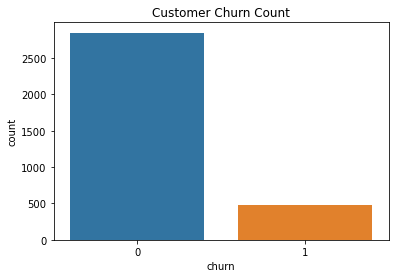
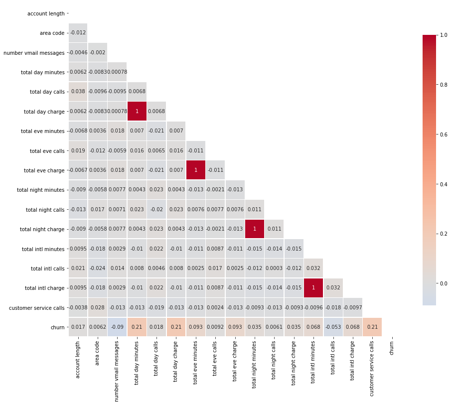
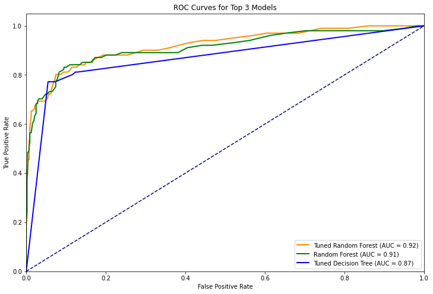
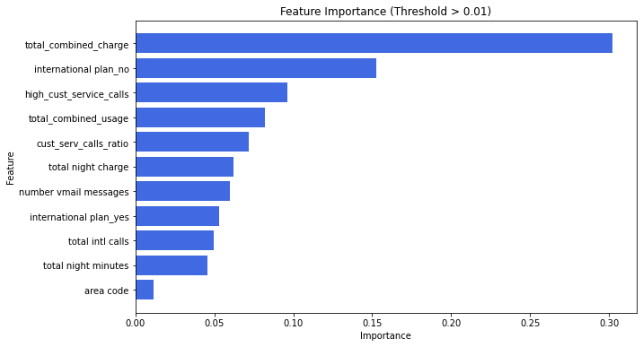

# Predicting Customer Churn for SyriaTel

## Business Understanding
The primary goal of this project is to develop a predictive model to identify customers likely to churn from SyriaTel, a telecommunications company. Customer churn is a critical issue in the telecom industry as retaining an existing customer is more cost-effective than acquiring a new one. The insights gained from this model will enable SyriaTel's management and marketing teams to implement targeted retention strategies, reduce revenue loss, and enhance customer satisfaction.

## Problem Statement
SyriaTel is experiencing high churn rates, leading to significant financial losses. This project aims to build a predictive model to identify customers at risk of churning, allowing the company to take proactive measures to retain them.

## Objectives
The project focuses on three primary objectives:
1. **Identify Key Predictors of Customer Churn**: Determine the features that most significantly influence customer churn.
2. **Develop and Evaluate Predictive Models**: Build and compare machine learning models, including Logistic Regression and Decision Trees, to predict customer churn accurately.
3. **Provide Actionable Insights for Customer Retention**: Offer recommendations based on model findings to help SyriaTel improve customer retention.

## Data Understanding

### Dataset Overview
The dataset contains information on 3,333 customers, with 21 features covering demographic data, service usage, and customer interaction metrics. The target variable is `churn`, indicating whether a customer has left the company.

#### Key Features:
- **State**: The state where the customer resides.
- **Account Length**: The number of days the customer has had an account.
- **International Plan**: Whether the customer has an international plan.
- **Customer Service Calls**: The number of calls the customer has made to customer service.
- **Churn**: Target variable, 1 if the customer has churned, otherwise 0.

## Exploratory Data Analysis (EDA)

### Churn Distribution
We observed a class imbalance in the churn data, with significantly more customers not churning compared to those who did.

## Multivariate Analysis

### Correlation Heatmap
A heatmap was used to visualize the correlation between numerical features. Several features exhibited perfect multicollinearity, leading to the removal of redundant features to improve model performance.

## Feature Engineering
Feature engineering involved creating combined features, ratios, and flags to enhance the predictive power of the model. Redundant features were dropped to simplify the model.

## Model Development

### Logistic Regression, Decision Trees, and Random Forests
Three models were developed: Logistic Regression, Decision Trees, and Random Forests. Each model was evaluated using metrics such as precision, recall, accuracy, and F1-score.

### Model Evaluation
- **Confusion Matrix**: Visualized the performance of each model by showing the distribution of true positives, true negatives, false positives, and false negatives.
- **ROC Curve and AUC**: The ROC curve and AUC score provided insight into the models' ability to distinguish between churned and non-churned customers.

## Model Tuning
Hyperparameter tuning was applied to each model to improve performance. The Decision Tree model showed the best generalization, with a good balance between precision, recall, accuracy, and F1-score.

## Feature Importance
The Decision Tree model identified the most important features influencing churn, including:
- **Total Combined Charge**
- **International Plan (No)**
- **High Customer Service Calls**
- **Total Combined Usage**

## Conclusion
- **Cost-Related Features**: Pricing and perceived value are critical in customer churn, with total combined charges being the most significant factor.
- **Service-Related Dissatisfaction**: High customer service interactions are strong indicators of potential churn, suggesting dissatisfaction with service.
- **Plan Offerings**: The presence or absence of specific plans, especially international plans, is vital in predicting churn.

## Recommendations
- **Target High-Value Customers**: Focus on customers with high total charges, offering discounts or personalized plans to increase retention.
- **Improve Customer Service**: Enhance customer service efficiency to reduce churn.
- **Reassess International Plans**: Ensure international plans meet customer needs and are competitively priced.

## Next Steps
Implement the findings and recommendations in SyriaTel’s retention strategies to reduce churn and increase profitability.

